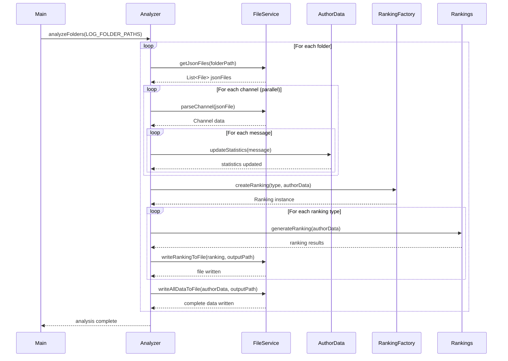

# Discord Chat Analyzer

A high-performance Java application for analyzing Discord chat exports and generating comprehensive statistics and
rankings about user activity, engagement, and behavior patterns.

## 🚀 Features

### 📊 Analytics & Rankings

- **Message Statistics**: Total messages, average word count per message, most active users
- **Engagement Metrics**: Most common reactions, emoji usage patterns, user mentions
- **Content Analysis**: Attachments sent, embeds shared, word count analysis
- **Temporal Analysis**: Account age ranking, first message timestamps
- **Activity Patterns**: User activity levels and participation metrics

### ⚡ Performance Optimizations

- **Parallel Processing**: Multi-threaded analysis for faster processing
- **Memory Efficient**: Optimized data structures and algorithms
- **Scalable Architecture**: Handles large Discord exports efficiently
- **Concurrent I/O**: Parallel file reading and JSON processing

### 🗂️ Organization Features

- **Multi-Server Support**: Analyze multiple Discord servers simultaneously
- **Organized Output**: Results separated by server in dedicated directories
- **JSON Export**: Machine-readable output for further analysis
- **Configurable Thresholds**: Customizable minimum message requirements

## 📋 Requirements

- **Java**: Version 21 or higher
- **Maven**: Version 3.6+ for building
- **Memory**: Minimum 2GB RAM (4GB+ recommended for large datasets)
- **Storage**: Sufficient space for Discord export files and output

## 🛠️ Installation & Setup

### 1. Clone the Repository

```bash
git clone git@github.com:LucaNerlich/Discord-Chat-Analyzer.git
cd discordchatanalyzer/java
```

### 2. Build the Project

```bash
mvn clean compile
```

### 3. Configure Data Sources

Edit `src/main/java/analyzer/config/AnalyzerConfig.java`:

```java
public static final List<String> LOG_FOLDER_PATHS = List.of(
    "logs/your-server-1",
    "logs/your-server-2"
    // Add more server folders as needed
);
```

### 4. Prepare Discord Export Data

Download logs via https://github.com/Tyrrrz/DiscordChatExporter.

Place your Discord chat export JSON files in the configured folders:

```
logs/
├── your-server-1/
│   ├── channel-1.json
│   ├── channel-2.json
│   └── ...
├── your-server-2/
│   ├── general.json
│   ├── off-topic.json
│   └── ...
```

## 🚀 Usage

### Running the Analysis

```bash
mvn exec:java -Dexec.mainClass="analyzer.Main"
```

### Example Output Structure

After running the analysis, results are organized by server:

```
logs/
├── your-server-1/
│   ├── channel-1.json              # Original data
│   ├── channel-2.json
│   └── output/                     # Generated analysis
│       ├── output-all.json
│       ├── ranking-most-messages.json
│       ├── ranking-account-age.json
│       ├── ranking-avg-word-count.json
│       ├── ranking-most-embeds.json
│       ├── ranking-most-attachments.json
│       ├── ranking-times-mentioned.json
│       └── ranking-most-common-reaction.json
```

## 📊 Analysis Types

### 1. User Activity Rankings

#### Most Messages

- **File**: `ranking-most-messages.json`
- **Content**: Users ranked by total message count
- **Includes**: Total server message statistics

#### Average Word Count

- **File**: `ranking-avg-word-count.json`
- **Content**: Users ranked by average words per message
- **Filter**: Minimum 10 messages required

#### Account Age

- **File**: `ranking-account-age.json`
- **Content**: Users ranked by their first message date (server join approximation)

### 2. Engagement Rankings

#### Most Common Reactions

- **File**: `ranking-most-common-reaction.json`
- **Content**: Emoji reactions ranked by frequency across all users
- **Includes**: Total reaction counts and emoji details

#### Times Mentioned

- **File**: `ranking-times-mentioned.json`
- **Content**: Users ranked by how often they were mentioned by others

### 3. Content Rankings

#### Most Attachments

- **File**: `ranking-most-attachments.json`
- **Content**: Users ranked by number of attachments shared

#### Most Embeds

- **File**: `ranking-most-embeds.json`
- **Content**: Users ranked by number of embeds posted

## ⚙️ Configuration

### Performance Settings

Located in `AnalyzerConfig.java`:

```java
// Analysis thresholds
public static final int MIN_AMOUNT_MESSAGES = 10;
public static final int MIN_MESSAGES_FOR_AVG_WORD_COUNT = 10;

// Performance tuning
public static final int THREAD_POOL_SIZE = Runtime.getRuntime().availableProcessors();
public static final boolean ENABLE_PARALLEL_FOLDER_PROCESSING = true;
public static final boolean ENABLE_PARALLEL_CHANNEL_PROCESSING = true;
```

### Data Source Configuration

```java
// Add your Discord export folders here
public static final List<String> LOG_FOLDER_PATHS = List.of(
        "logs/server-name-1",
        "logs/server-name-2"
    );
```

## 🔧 Development

**Application Flow:**



### Building from Source

```bash
# Clean build
mvn clean compile

# Run with custom memory settings
mvn exec:java -Dexec.mainClass="analyzer.Main" -Dexec.args="-Xmx4g"
```

### Adding New Rankings

1. Create new class extending `Ranking`
2. Implement required methods
3. Add to `RankingFactory`
4. Update `RankingType` enum

### Project Structure

```
src/main/java/analyzer/
├── config/           # Configuration classes
├── models/           # Data models and DTOs
│   ├── channel/      # Discord channel models
│   ├── message/      # Message and content models
│   └── ranking/      # Ranking system
├── service/          # Service layer (I/O, processing)
├── stats/            # Statistics and data analysis
└── utils/            # Utility classes and helpers
```

## 📝 Example Data Format

### Input (Discord Export JSON)

```json
{
    "guild": {
        "name": "My Discord Server"
    },
    "channel": {
        "name": "general"
    },
    "messages": [
        {
            "id": "123456789",
            "content": "Hello world!",
            "author": {
                "id": "987654321",
                "name": "username",
                "nickname": "display_name"
            },
            "timestamp": "2024-01-01T12:00:00.000Z",
            "reactions": [
                {
                    "emoji": {
                        "name": "👍"
                    },
                    "count": 5
                }
            ]
        }
    ]
}
```

### Output (Ranking JSON)

```json
{
    "messagesSent": 15420,
    "mostMessages": {
        "user1_data": 1250,
        "user2_data": 980,
        "user3_data": 750
    }
}
```

## 🐛 Troubleshooting

### Out of Memory Error

```bash
# Increase heap size
mvn exec:java -Dexec.mainClass="analyzer.Main" -Dexec.args="-Xmx8g"
```

### File Not Found

- Verify Discord export JSON files are in configured directories
- Check that `LOG_FOLDER_PATHS` matches your folder structure
- Ensure JSON files are valid Discord exports

### Performance Issues

- Increase `THREAD_POOL_SIZE` for more parallel processing
- Ensure sufficient RAM available
- Consider processing servers separately for very large datasets

## 📄 License

This project is licensed under the MIT License - see the LICENSE file for details.

---

**Note**: This tool is designed for personal use with your own Discord data. Ensure you comply with Discord's Terms of
Service and applicable privacy laws when analyzing chat data.
